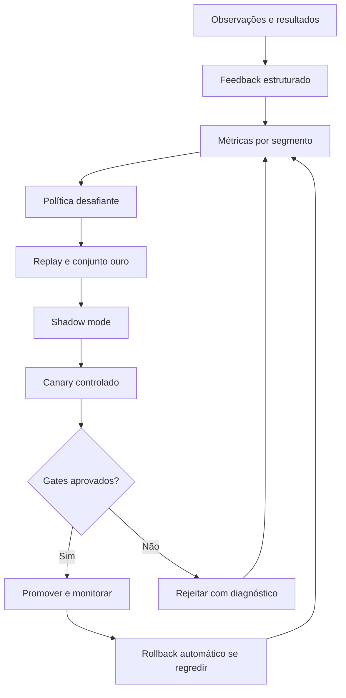
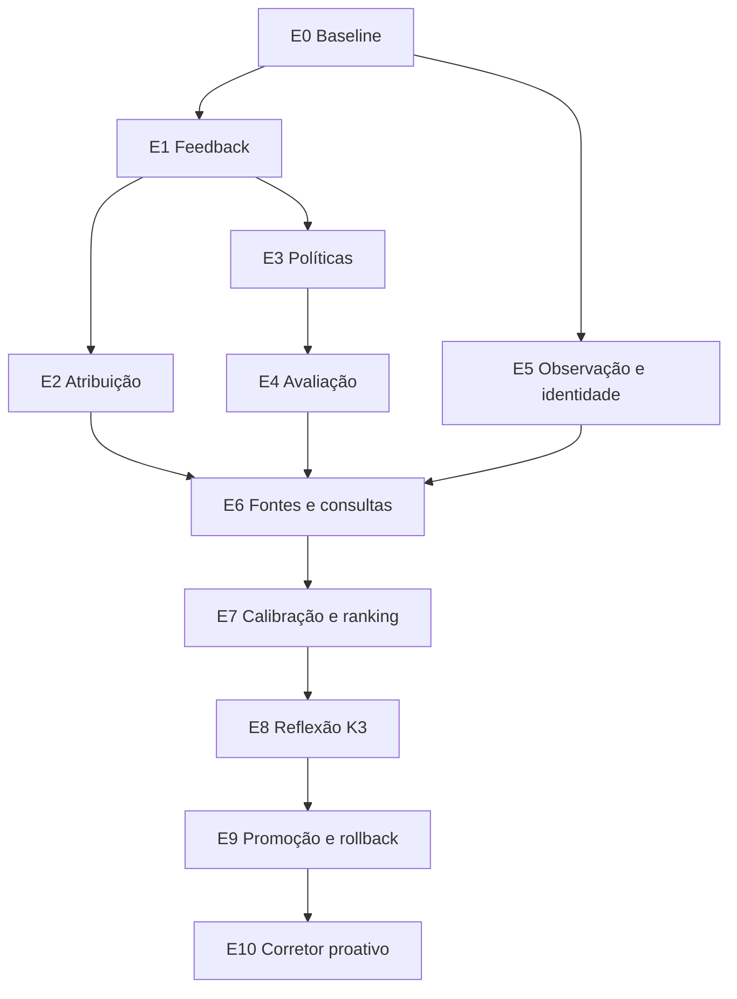

# Roadmap auditado — Autoevolução do Corretor Inteligente Autônomo

- **Projeto:** Corretor Inteligente / Radar Fundiário
- **Data da auditoria:** 19/07/2026
- **Branch auditada:** `agent/kimi-personal-assistant`
- **Baseline de código:** qualificação de evidências antes do K3 (`feat(agent): qualificar evidencias antes do K3`)
- **Documento relacionado:** `ULTRAROADMAP-INTELIGENCIA-IMOBILIARIA.md`
- **Objetivo deste documento:** transformar o Marco F — sistema autoaperfeiçoável controlado — em uma sequência concreta de implementação, validação, rollout e operação.

---

## 1. Decisão executiva

O Corretor Inteligente ainda **não aprende de forma operacional com os próprios erros**. Ele já possui partes importantes da fundação:

- registra uso, falhas, fallback, duração e contexto do assistente;
- guarda conversas e uma memória estática de preferências;
- cria propostas determinísticas de melhoria de eficiência;
- registra evidências, hipóteses e revisão humana de sinais;
- preserva auditoria e separa hipótese de fato;
- qualifica evidências antes do K3 e mede rejeições por fonte;
- possui eventos de domínio e resultados comerciais básicos no funil.

Contudo, essas partes ainda não formam um ciclo fechado. Hoje o sistema:

- não sabe por que um sinal foi rejeitado;
- não distingue “conferido” de “confirmado como correto”;
- não liga um sinal a tarefa, contato, visita, proposta, fechamento ou perda;
- não mede precisão por fonte, tipo, relação, política ou versão;
- não calibra a confiança produzida pelo K3;
- não possui política campeã e desafiante;
- não executa replay, shadow mode, canary ou rollback de política;
- não promove automaticamente uma política melhor;
- não transforma erros revisados em regras candidatas estruturadas;
- não atualiza suas memórias a partir de evidência de comportamento ou resultado.

Portanto, a meta não é liberar “autonomia total” imediatamente. A meta é alcançar **autonomia progressiva, mensurável e reversível**.

O alvo recomendado é:

> Um corretor digital que observa e investiga continuamente, aprende com confirmações, correções e resultados, testa versões melhores em silêncio e promove automaticamente apenas mudanças de baixo risco que provem melhoria sem regressão.

Código, schema, regras jurídicas, cálculos de avaliação, mensagens externas e fatos canônicos nunca serão alterados silenciosamente pelo modelo.

---

## 2. Método da auditoria

A auditoria examinou:

- migrations `006`, `009`, `010`, `014`, `016` e `017`;
- `assistente.js` e a memória do perfil;
- `agent-review.js` e o timer de revisão econômica;
- `intelligence-orchestrator.js`;
- `evidence-qualification.js`;
- `os-core.js`, o funil comercial e os eventos de domínio;
- `os-app.js`, a experiência de revisão no dossiê;
- contratos e testes existentes;
- logs reais fornecidos da primeira execução K3/Hermes;
- o ultraroadmap de inteligência imobiliária já aprovado.

O diagnóstico separa cinco conceitos frequentemente confundidos:

| Conceito | Definição | Situação atual |
|---|---|---|
| Memória | Guardar fatos, preferências e histórico | Parcial |
| Feedback | Registrar se uma saída foi útil, correta ou errada | Muito parcial |
| Aprendizado | Alterar decisões futuras a partir do feedback | Ausente |
| Adaptação | Escolher fonte, consulta, score ou prioridade melhor | Ausente |
| Autoevolução | Criar, testar, promover e reverter políticas | Ausente |

---

## 3. Resultado da auditoria

### 3.1 Maturidade atual

Escala utilizada: `0` inexistente, `1` inicial, `2` parcial, `3` funcional, `4` maduro, `5` autoaperfeiçoável comprovado.

| Capacidade | Nota | Evidência observada | Lacuna crítica |
|---|---:|---|---|
| Execução autônoma de pesquisas | 2,5 | fila, timer, retomada por lote | ainda pesquisa por plano amplo e sem valor marginal |
| Qualidade da entrada | 2 | qualificação v1 e saúde de fonte | falta extração/identidade por fonte e fixtures amplas |
| Memória de mercado | 1 | evidências e acervo | falta observação imutável e identidade longitudinal |
| Memória do usuário | 1 | `agent_profiles.memories` | conteúdo estático, sem mecanismo de confirmação/expiração |
| Feedback de hipótese | 1 | `reviewed`/`rejected` por imóvel | sem motivo, correção, inconclusivo ou desfazer visível |
| Resultado comercial | 1,5 | estágio, fechamento e perda no funil | não existe atribuição ao sinal que originou/ajudou a ação |
| Métricas de inteligência | 0,5 | contagens de evidência e uso | sem precisão, calibração, utilidade ou custo por acerto |
| Política versionada | 0,5 | versão na qualificação e avaliação | sem registro central, ativação, shadow e rollback |
| Avaliação contínua | 0 | inexistente | sem conjunto ouro, replay ou holdout |
| Aprendizado por erros | 0 | inexistente | rejeições não alteram decisões futuras |
| Auto-promoção segura | 0 | inexistente | sem champion/challenger e gates |
| Segurança da autonomia | 3 | leitura controlada, auditoria, sem escrita canônica | falta governança específica de políticas adaptativas |
| Frontend de aprendizado | 1 | conferir/descartar | não explica o que aprendeu nem captura resultado suficiente |

**Diagnóstico consolidado:** o sistema está entre os níveis de autonomia operacional `L1` e `L2`, mas ainda no nível `L0` de aprendizado validado.

### 3.2 Achados positivos que devem ser preservados

#### A. Hipótese não altera o fato

O orquestrador não escreve em `inventory_properties`, `listings`, `properties` ou `valuations`. Essa separação deve permanecer.

#### B. Evidência rastreável

Os findings exigem IDs conhecidos de evidência. Isso é a base para avaliação posterior.

#### C. Revisão por vínculo

O mesmo finding pode ter relação diferente com imóveis diferentes. Feedback e aprendizado devem continuar no vínculo, não apenas no finding global.

#### D. Funil comercial existente

Oportunidades já registram estágios, perda e eventos. Não é necessário inventar um CRM paralelo; é necessário criar atribuição rastreável entre inteligência e funil.

#### E. Propostas de melhoria sem aplicação autônoma

`agent-review.js` prova que a arquitetura aceita o conceito de proposta revisável. O mecanismo será ampliado, não descartado.

#### F. Qualificação antes do K3

A política de evidência v1 cria o primeiro sinal mensurável para aprendizado de fontes sem gastar modelo com rejeições óbvias.

### 3.3 Achados críticos

#### CR-01 — Proposta de melhoria não executa aprendizado

`agent-review.js` observa somente falha, fallback e tamanho médio de contexto. Aprovar uma proposta altera o status para `approved`, mas não cria experimento, não testa e não aplica política.

**Efeito:** a tela “Aprendizado controlado” hoje é uma caixa de sugestões, não um motor de evolução.

#### CR-02 — “Conferido” não significa verdade

`reviewPropertyFinding` aceita apenas `reviewed` ou `rejected`. Não captura:

- confirmado correto;
- falso positivo;
- inconclusivo;
- útil, mas não acionável;
- correto, porém ligado ao imóvel errado;
- motivo da rejeição;
- valor corrigido;
- evidência contrária;
- decisão substituída ou desfeita.

**Efeito:** não existe rótulo de qualidade suficiente para treinamento, calibração ou avaliação.

#### CR-03 — Confiança não é calibrada

A confiança é produzida pelo K3. Em conflito de fingerprint, `saveFindings` conserva o maior valor com `GREATEST`.

**Efeito:** repetição pode aumentar ou preservar confiança sem nova verdade. O número não representa probabilidade observada de acerto.

**Correção planejada:** preservar `model_confidence`, calcular `calibrated_confidence` separadamente e nunca promover confiança apenas porque um modelo repetiu a hipótese.

#### CR-04 — Ausência de atribuição ao resultado

O funil sabe se houve visita, proposta, fechamento ou perda, mas não sabe se determinado sinal:

- originou a oportunidade;
- ajudou a negociação;
- apenas foi visualizado;
- foi ignorado;
- contradisse uma decisão;
- chegou tarde demais.

**Efeito:** conversão comercial não pode retroalimentar prioridade com honestidade.

#### CR-05 — Memórias são estáticas

As memórias padrão são inseridas uma vez e recuperadas por escopo. Não existe ciclo de proposta, confirmação, validade, conflito ou esquecimento.

**Efeito:** o assistente parece lembrar, mas não aprende progressivamente o modo de trabalho.

#### CR-06 — Não existe registro central de políticas

Versões aparecem em strings dispersas, como `evidence-qualification-v1` e políticas de comparáveis.

**Efeito:** não é possível responder de forma confiável:

- qual versão produziu este sinal;
- quais parâmetros estavam ativos;
- qual versão é campeã;
- qual candidata está em teste;
- como desfazer uma promoção.

#### CR-07 — Não existe avaliação fora da produção

Os testes atuais validam contratos e regras, mas não existe:

- conjunto ouro de evidências;
- conjunto ouro de identidade;
- conjunto ouro de hipóteses;
- holdout não usado para propor política;
- replay de decisões históricas;
- comparação de ranking;
- Brier score ou erro de calibração;
- teste de regressão de custo/latência.

#### CR-08 — Saúde de fonte mede entrada, não utilidade

O registro de fonte mede qualificado/rejeitado. Ainda não mede:

- hipóteses confirmadas por fonte;
- falso positivo;
- campos corretos;
- ações geradas;
- custo por evidência útil;
- degradação ao longo do tempo.

#### CR-09 — O deploy da qualificação precisa de prova operacional

A implementação foi publicada, mas esta auditoria não recebeu ainda o resultado do deploy da migration `017` nem uma execução posterior com contagens qualificadas/rejeitadas.

**Gate:** nenhuma camada adaptativa será ativada antes dessa comprovação.

#### CR-10 — Escrita autônoma de código está corretamente desativada

O Hermes não cria skills ou aplica código sozinho.

**Decisão:** manter. Autoevolução será sobre políticas estruturadas e reversíveis. Mudança de código continua em branch, testes e revisão.

#### CR-11 — O qualificador v1 ainda é heurístico e incompleto

A qualificação atual bloqueia padrões conhecidos de catálogo, veículos, geografia, transação e identidade invalidada. Porém:

- a geografia por texto usa uma lista conhecida de localidades externas;
- conteúdo com geografia desconhecida pode ser aceito;
- anúncio individual é reconhecido por padrões genéricos de URL;
- conteúdo desconhecido com nenhuma rejeição recebe uso analítico;
- não existe extração específica por fonte;
- não existe detecção robusta de múltiplos anúncios na mesma página;
- não existe proveniência por campo.

**Efeito:** a v1 reduz contaminação conhecida, mas ainda não constitui verdade suficiente para aprendizado de identidade, preço ou eventos.

#### CR-12 — Registro de saúde ainda não controla a aquisição

O `intelligence_source_registry` recebe contagens e pode marcar a fonte como degradada ou preservar `blocked`. Entretanto, o coletor e `evidenceForAnalysis` ainda não consultam esse estado antes de coletar ou enviar evidência ao K3.

**Efeito:** saúde é atualmente observabilidade; circuit breaker e orçamento adaptativo ainda precisam ser implementados. A API expõe fontes, mas o frontend operacional ainda não apresenta essa área.

### 3.4 Baseline quantitativo observado

Os números disponíveis serão congelados na Entrega 0 e não tratados como metas finais:

| Medição | Valor observado | Leitura |
|---|---:|---|
| Resposta comum Hermes | 118 s em uma ocorrência | runtime pesado demais para interação comum sem roteamento apropriado |
| Planejamento K3 da primeira varredura | 71,7 s | aceitável apenas em processo assíncrono, ainda caro |
| Primeira análise monolítica | timeout em 180 s | motivou análise retomável por lotes |
| Evidências da execução ampliada | 108 | volume não representava qualidade |
| Candidatos intermediários | 43 | alta necessidade de consolidação/filtro |
| Findings preservados | 20 | utilidade ainda sem revisão/calibração suficiente |
| Suíte local após qualificação | 569 testes verdes | boa proteção contratual; ainda sem eval de qualidade real |

A execução em lotes resolveu perda total por timeout, mas não prova precisão. O próximo baseline deve medir quantas das 108 evidências seriam qualificadas pela política v1 e quantos dos 20 findings seriam confirmados, falsos, inconclusivos ou ligados ao escopo errado.

---

## 4. O que “ficar mais inteligente” significará

O produto será considerado mais inteligente quando melhorar, de forma demonstrável, pelo menos uma destas relações sem piorar as guardas:

1. mais evidências úteis por pesquisa realizada;
2. menos lixo chegando ao K3;
3. mais precisão na identidade do mesmo imóvel;
4. menos hipóteses falsas apresentadas;
5. confiança mais próxima da taxa real de acerto;
6. melhores sinais aparecendo primeiro;
7. menor tempo até uma ação útil;
8. menor custo por sinal confirmado;
9. mais resultados comerciais assistidos, sem confundir correlação com causa;
10. menos repetição de erro já corrigido pelo usuário.

Não serão aceitos como prova de aprendizado:

- mais texto;
- mais tokens;
- mais pesquisas;
- mais findings;
- confiança declarada pelo próprio modelo;
- clique em um card isolado;
- venda sem vínculo rastreável com o sinal;
- avaliação do K3 sobre a própria resposta sem dado externo.

Na primeira etapa, “aprender” não significa modificar os pesos internos do Kimi K3. A inteligência acumulada viverá em observações, memória confirmada, políticas, calibração, ranking, avaliações e escolha de ferramentas. Se futuramente existir fine-tuning adequado, a nova versão do modelo será tratada como qualquer challenger: conjunto ouro, holdout, shadow, canary e rollback.

---

## 5. Níveis de autonomia

| Nível | Capacidade | Estado | Regra de liberação |
|---|---|---|---|
| `L0` Assistivo | responde e mostra dados | existente | leitura segura |
| `L1` Operacional | executa jobs, coleta, retoma e atualiza | parcial | observabilidade e limites |
| `L2` Proativo | cria investigações por eventos e prioriza | próximo | eventos confiáveis e anti-spam |
| `L3` Adaptativo | ajusta fontes, consultas, calibração e ranking | planejado | feedback + avaliação + política versionada |
| `L4` Autoevolutivo controlado | cria challenger, testa, faz canary, promove e reverte | alvo | gates estatísticos e rollback comprovado |
| `L5` Autônomo irrestrito | altera código, fatos ou comunicação sozinho | proibido | não será implementado |

O objetivo de produto é `L4`, não `L5`.

---

## 6. Arquitetura-alvo do ciclo de aprendizado

### 6.1 Dois trilhos que precisam convergir

#### Trilho A — Memória confiável do mercado

- evidências qualificadas;
- observações imutáveis;
- URL e ID externo;
- identidade entre anúncios, unidades e imóveis;
- linha do tempo;
- eventos corrigíveis;
- hipóteses tipadas.

#### Trilho B — Aprendizado controlado

- feedback estruturado;
- atribuição de ações e resultados;
- políticas versionadas;
- conjuntos de avaliação;
- calibração;
- champion/challenger;
- shadow/canary;
- promoção e rollback.

O feedback começa imediatamente. A promoção automática de ranking e confiança só começa quando identidade e eventos atingirem seus gates.

---

## 7. Fontes de aprendizado

### 7.1 Feedback explícito — verdade de maior peso

No sinal, o usuário poderá marcar:

- `confirmed`: evidências sustentam o sinal;
- `false_positive`: sinal está incorreto;
- `inconclusive`: ainda não há prova suficiente;
- `watching`: é relevante, mas deve ser acompanhado;
- `expired`: poderia estar correto, mas perdeu validade;
- `wrong_scope`: fato existe, porém está ligado ao imóvel/unidade/contexto errado.

Motivos estruturados:

- imóvel diferente;
- unidade diferente;
- catálogo ou página múltipla;
- geografia errada;
- venda/aluguel incorreto;
- fonte desatualizada;
- preço não comprovado;
- mudança inexistente;
- duplicado;
- evidência insuficiente;
- sem relevância comercial;
- outro, com observação opcional.

### 7.2 Correções explícitas

Uma correção pode informar:

- relação correta: direto, comparável, bairro ou não relacionado;
- tipo correto da hipótese;
- imóvel/unidade correta;
- valor observado correto com evidência;
- fonte contrária;
- motivo pelo qual a inferência falhou.

Correções nunca sobrescrevem o registro anterior. Criam nova revisão que referencia e substitui a anterior.

### 7.3 Sinais comportamentais — utilidade, não verdade

- abriu as fontes;
- pediu investigação adicional;
- transformou em tarefa;
- registrou contato;
- apresentou imóvel;
- marcou visita;
- voltou ao sinal;
- adiou ou ignorou.

Esses eventos ajudam a medir acionabilidade. Não podem confirmar sozinhos que o sinal era verdadeiro.

### 7.4 Resultados comerciais — impacto, não causalidade automática

- contato iniciado;
- resposta recebida;
- visita;
- proposta;
- fechamento;
- perda e objeção;
- valor/tempo do ciclo quando disponível.

O sistema registra `originated`, `assisted`, `observed` ou `contradicted`. Um fechamento assistido aumenta utilidade, mas não transforma todas as hipóteses semelhantes em fatos.

### 7.5 Feedback operacional

- timeout;
- fallback;
- JSON inválido;
- fonte degradada;
- consulta sem resultado útil;
- custo e latência;
- lote sem findings;
- síntese falha;
- repetição de consulta;
- evidência rejeitada por motivo.

---

## 8. Modelo de dados a implementar

### 8.1 Migration `018-intelligence-feedback.sql`

#### `intelligence_feedback`

- `id`;
- organização;
- finding;
- vínculo com imóvel;
- decisão estruturada;
- motivo estruturado;
- correção em JSON validado;
- comentário opcional;
- usuário/ator;
- versão de política vista;
- feedback substituído;
- instante;
- estado ativo/revertido.

Invariantes:

- append-only lógico;
- apenas um feedback ativo por usuário/vínculo, mas histórico preservado;
- desfazer cria compensação, não `DELETE`;
- feedback de outro imóvel não muda o vínculo atual;
- comentário nunca entra diretamente em prompt de política.

### 8.2 Migration `019-intelligence-attribution.sql`

#### `intelligence_action_links`

Liga finding a:

- tarefa;
- oportunidade;
- contato;
- visita;
- avaliação;
- nova investigação.

Campos principais:

- tipo de atribuição;
- força declarada;
- origem explícita ou inferida;
- evento inicial;
- última progressão;
- resultado;
- instante.

#### `intelligence_outcomes`

Snapshot auditável do desfecho:

- ação tomada;
- estágio alcançado;
- perda/objeção;
- resultado qualitativo;
- atribuição;
- janela temporal;
- fonte do evento.

### 8.3 Migration `020-intelligence-policy-registry.sql`

#### `intelligence_policy_versions`

- namespace: qualificação, fonte, consulta, identidade, hipótese, calibração ou ranking;
- versão semântica;
- pai;
- estado: `draft`, `shadow`, `canary`, `active`, `retired`, `rejected`;
- especificação JSON com schema fixo;
- limites imutáveis;
- risco;
- autor: código, regra determinística ou K3;
- justificativa e evidências;
- hash;
- datas de ativação e retirada.

#### `intelligence_policy_assignments`

- organização/segmento;
- versão atribuída;
- grupo champion/challenger;
- percentual;
- início/fim;
- motivo;
- rollback de referência.

Cada job, evidência, match e hipótese deve registrar as versões que o produziram.

### 8.4 Migration `021-intelligence-evaluation.sql`

#### `intelligence_eval_datasets`

- tipo do conjunto;
- versão;
- origem;
- estado;
- janela temporal;
- separação treino/validação/holdout;
- hash.

#### `intelligence_eval_cases`

- entrada congelada;
- resposta esperada;
- tolerâncias;
- fonte do rótulo;
- peso;
- privacidade;
- status de disputa.

#### `intelligence_eval_runs` e `intelligence_eval_results`

- política avaliada;
- baseline;
- métricas globais e por segmento;
- violações de guarda;
- custo/latência;
- decisão do gate;
- artefatos de diagnóstico.

### 8.5 Migration `022-intelligence-learning-cycles.sql`

#### `intelligence_learning_cycles`

- janela analisada;
- problema observado;
- política campeã;
- candidata;
- hipótese de melhoria;
- métricas antes/depois;
- estágio;
- decisão;
- rollback;
- K3 usado e versão;
- auditoria.

#### `intelligence_error_clusters`

- taxonomia do erro;
- segmento;
- exemplos referenciados;
- frequência e tendência;
- impacto;
- política relacionada;
- estado de correção.

### 8.6 Evolução da memória do usuário

As memórias deixam de ser uma lista plana e passam a ter:

- origem;
- escopo;
- confiança;
- primeira/última evidência;
- confirmação explícita;
- validade;
- contradições;
- estado proposto/confirmado/expirado/rejeitado.

Preferência inferida nunca substitui preferência declarada.

---

## 9. Políticas que poderão aprender

### 9.1 Saúde e orçamento de fonte

- **Entrada:** qualificação, falso positivo, campos disponíveis, custo e latência.
- **Saída:** ativa, degradada, circuito aberto temporário, orçamento por fonte.
- **Método inicial:** taxas suavizadas, intervalo de confiança e decaimento temporal.
- **Automação permitida:** reduzir temporariamente frequência/orçamento dentro de limites.
**Automação proibida:** bloquear permanentemente uma fonte sem revisão ou apagar histórico.

### 9.2 Seleção de consulta

- **Entrada:** consulta, intenção, resultados qualificados, hipóteses confirmadas e custo.
- **Saída:** prioridade e orçamento de padrões de consulta por segmento.
- **Método inicial:** score conservador de utilidade/custo; contextual bandit somente após volume suficiente.
**Guarda:** manter exploração mínima de fontes/padrões novos para evitar ciclo fechado.

### 9.3 Identidade

- **Entrada:** pares revisados, features, relação e correções.
- **Saída:** pesos e limiares de `possible`/`probable`.
- **Automação permitida:** ordenar candidatos.
**Automação proibida inicialmente:** merge automático de unidade ou imóvel.

### 9.4 Confiança calibrada

Conservar três valores separados:

- `model_confidence`: número produzido pelo K3;
- `rule_strength`: força determinística das evidências;
- `calibrated_confidence`: probabilidade estimada com dados revisados.

Métodos em ordem de maturidade:

1. tabela por faixas e tipo;
2. Beta-Binomial/hierárquico para amostra pequena;
3. isotonic ou logistic calibration quando houver volume;
4. calibração por fonte, relação e tipo somente quando os segmentos forem estáveis.

Até existir amostra mínima, a UI usa linguagem qualitativa e informa “calibração ainda limitada”.

### 9.5 Ranking de prioridade

O ranking passa a ser decomposto:

\[
Prioridade = P(acerto) \times Impacto \times Urgência \times Acionabilidade \times Atualidade \times Cobertura
\]

Cada componente é armazenado e explicável. Conversão comercial ajusta impacto/acionabilidade, não a verdade factual.

### 9.6 Memória e preferência

Aprender:

- bairros/tipos normalmente priorizados;
- formato de resposta;
- ações preferidas;
- restrições de investidores;
- objeções recorrentes.

Não aprender automaticamente:

- dado pessoal sensível;
- preferência a partir de uma única ação;
- discriminação territorial/pessoal indevida;
- inferência contrária a declaração explícita.

### 9.7 Reflexão K3

O K3 poderá:

- resumir clusters de erro;
- sugerir causa provável;
- propor política candidata dentro de um schema;
- explicar diferenças champion/challenger;
- sugerir novas consultas e stop conditions;
- produzir casos adversariais para avaliação.

O K3 não poderá:

- declarar que sua política é melhor sem avaliação;
- editar guardrails;
- alterar schema/código em produção;
- promover a própria proposta;
- criar rótulos de verdade para os próprios outputs;
- usar texto externo como instrução.

---

## 10. Protocolo champion/challenger

### 10.1 Criação da candidata

Uma candidata nasce de:

- regressão detectada;
- cluster de erro recorrente;
- mudança de fonte;
- feedback humano suficiente;
- oportunidade de custo/latência;
- proposta K3 validada contra schema;
- alteração manual versionada.

### 10.2 Replay offline

Executar a campeã e a candidata sobre o mesmo conjunto congelado.

Comparar:

- precisão e falso positivo;
- recall onde mensurável;
- Brier score;
- Expected Calibration Error;
- NDCG/posição de sinais confirmados;
- violações de guardas;
- custo;
- latência;
- cobertura;
- estabilidade por bairro, tipo, fonte e relação.

### 10.3 Holdout

Casos usados pelo K3 ou pelas regras para formular a candidata não podem decidir a promoção. Um holdout separado é obrigatório.

### 10.4 Shadow mode

A candidata roda em produção sem afetar o usuário. São guardados:

- decisão da campeã;
- decisão da candidata;
- divergência;
- custo adicional;
- resultado observado posteriormente.

### 10.5 Canary

Somente mudanças elegíveis passam para 10%–20% de casos, com atribuição estável e reversível.

### 10.6 Gates iniciais para promoção automática de baixo risco

- pelo menos 50 casos elegíveis revisados, salvo regra determinística com fixture completa;
- pelo menos 14 dias de observação ou duas janelas completas de fonte;
- zero violação de guarda crítica;
- falso positivo não piora mais de 2 pontos percentuais;
- precisão melhora pelo menos 5 pontos percentuais ou custo cai 20% sem perda relevante;
- Brier/ECE não pioram para política de confiança;
- nenhum segmento crítico perde mais de 5 pontos;
- latência p95 dentro do orçamento;
- custo por sinal confirmado não aumenta sem benefício explícito;
- rollback testado antes da promoção.

Com menos de 50 casos, o sistema pode recomendar, testar e exibir a candidata, mas não promovê-la sozinho.

### 10.7 Rollback

Rollback automático quando ocorrer:

- violação crítica;
- aumento abrupto de falso positivo;
- geografia/transação errada;
- fonte única dominando resultados;
- custo ou latência acima do teto;
- drift fora da faixa do canary;
- falha de schema ou rastreabilidade.

Ativação e rollback são troca de referência de política; nenhum dado histórico é apagado.

---

## 11. Matriz de autonomia e aprovação

Promoção automática não significa ausência de revisão. As classes de baixo risco, seus limites e seus gates são pré-aprovados uma vez; cada candidata continua sendo revisada automaticamente por replay, holdout, shadow, canary e guardas. Classes de médio/alto risco exigem aprovação humana por versão.

| Mudança | Pode propor | Pode testar sozinho | Pode promover sozinho | Exige humano |
|---|---:|---:|---:|---:|
| Circuit breaker temporário de fonte | Sim | Sim | Sim, com limites | Não |
| Orçamento de consulta dentro do teto | Sim | Sim | Sim, após gates | Não |
| Prioridade de padrões de busca | Sim | Sim | Sim, após gates | Não |
| Calibração de confiança | Sim | Sim | Sim, após volume/gates | Não |
| Peso de ranking em faixa limitada | Sim | Sim | Sim, após canary | Não |
| Novo prompt estruturado | Sim | Sim | Não inicialmente | Sim |
| Alterar guardrails | Não | Não | Não | Engenharia + revisão |
| Merge de imóvel/unidade | Sim | Shadow | Não inicialmente | Sim |
| Alterar fato canônico | Não | Não | Não | Ação humana/fonte verificável |
| Alterar cálculo de avaliação | Sim | Replay | Não | Avaliador/engenharia |
| Conclusão jurídica/urbanística | Não | Não | Não | Profissional responsável |
| Enviar WhatsApp/e-mail | Pode preparar | Não enviar | Não | Usuário autoriza/envia |
| Alterar código ou migration | Pode sugerir | CI em branch | Não | Revisão e deploy |
| Coletar dado pessoal novo | Não por inferência | Não | Não | Finalidade/consentimento |

---

## 12. Frontend como parte do aprendizado

### 12.1 Card de sinal v2

Cada card deverá mostrar:

- o que foi observado;
- relação: imóvel, unidade, comparável ou bairro;
- o que ainda é hipótese;
- validade/atualidade;
- confiança calibrada ou aviso de amostra insuficiente;
- por que apareceu;
- fontes;
- próxima verificação;
- próxima ação.

Ações primárias:

- “Confirmar sinal”;
- “Está incorreto”;
- “Ainda inconclusivo”;
- “Acompanhar”.

### 12.2 Folha de motivo

Depois de rejeitar ou corrigir:

- motivos em um toque;
- detalhe opcional;
- relação correta opcional;
- nenhuma pergunta longa obrigatória;
- confirmação clara de que o feedback será usado;
- botão desfazer.

### 12.3 Transformar sinal em ação

- criar tarefa;
- iniciar contato;
- ligar a oportunidade;
- pedir nova investigação;
- acompanhar por prazo;
- preparar mensagem sem enviar;
- registrar resultado.

O vínculo com o finding é criado automaticamente e permanece auditável.

### 12.4 Histórico de decisões

No dossiê:

- sinal apresentado;
- fontes abertas;
- feedback;
- correção;
- ação criada;
- desfecho;
- política que produziu;
- alteração posterior da política;
- opção de desfazer quando aplicável.

### 12.5 Área “Como o radar está melhorando”

Área secundária, fora da navegação principal, com:

- quantidade de sinais revisados;
- taxa de confirmação por tipo;
- principais erros corrigidos;
- fontes degradadas/recuperadas;
- política ativa;
- candidata em shadow/canary;
- benefício medido;
- último rollback;
- propostas que exigem aprovação.

Não mostrar tokens, prompts ou nomes técnicos na experiência comum.

### 12.6 Estados obrigatórios

- sem dados suficientes;
- coletando feedback;
- candidata em teste;
- divergência em revisão;
- canary ativo;
- melhoria promovida;
- rollback executado;
- aprendizado pausado por segurança.

---

## 13. Plano de execução

Cada entrega abaixo será um commit/deploy independente, com migration aditiva, teste e rollback lógico. Frontend e observabilidade entram junto da capacidade correspondente.

## Entrega 0 — Provar o baseline em produção

**Objetivo:** confirmar a qualificação v1 e congelar métricas antes de qualquer aprendizado.

### Execução

- implantar commit da qualificação e migration `017`;
- executar investigação direcionada em imóvel real;
- contar evidências qualificadas/rejeitadas por motivo e fonte;
- verificar que rejeitados não chegam aos lotes K3;
- medir tempo por etapa, candidatos, findings e fallback;
- registrar snapshot `baseline-2026-07`;
- verificar frontend sem F5.

### Gate

- migration aplicada;
- zero catálogo/veículo/geografia conhecida nos lotes avaliados;
- cobertura visível no dossiê;
- logs e SQL conciliam as mesmas contagens.

### Rollback

- pausar novos jobs e reverter o código para a versão anterior se a migration ou o fluxo falhar;
- manter as colunas aditivas e evidências preservadas;
- nunca reintroduzir evidência não qualificada no K3 apenas para manter a fila rodando;
- nunca apagar qualificação já registrada.

## Entrega 1 — Feedback semanticamente útil

**Objetivo:** criar rótulos que realmente representem acerto, erro e incerteza.

### Backend

- migration `018-intelligence-feedback.sql`;
- novo módulo `intelligence-feedback.js`;
- API de criar, substituir e desfazer feedback;
- taxonomia e validação;
- evento de domínio para cada decisão;
- consulta de histórico por vínculo.

### Frontend

- quatro decisões principais;
- motivos rápidos;
- correção de relação;
- desfazer;
- estado revisado sem esconder histórico.

### Testes

- isolamento por organização;
- feedback concorrente;
- compensação/desfazer;
- XSS/CSRF;
- finding de outro imóvel;
- motivo inválido;
- histórico preservado.

### Gate

- 100% das revisões novas têm decisão estruturada;
- feedback nunca altera fato canônico;
- rejeitado pode ser consultado e desfeito.

## Entrega 2 — Atribuição de ação e resultado

**Objetivo:** saber se o sinal gerou movimento e o que aconteceu depois.

### Backend

- migration `019-intelligence-attribution.sql`;
- criar tarefa/oportunidade/investigação a partir do sinal;
- guardar `finding_id` e vínculo;
- observar mudanças do funil via `domain_events`;
- snapshots de resultado;
- impedir dupla atribuição idêntica.

### Frontend

- “Transformar em tarefa”;
- “Registrar contato”;
- “Ligar a negociação”;
- acompanhamento do desfecho no card;
- pergunta de resultado somente no momento natural do funil.

### Gate

- toda ação iniciada no sinal tem atribuição;
- estágio comercial não é interpretado automaticamente como confirmação factual;
- fechamento/perda preservam a trilha completa.

## Entrega 3 — Registro central e versionado de políticas

**Objetivo:** tornar toda decisão reproduzível e reversível.

### Backend

- migration `020-intelligence-policy-registry.sql`;
- `policy-registry.js` com schema por namespace;
- seed das políticas atuais;
- jobs/findings/evidências gravam versões;
- ativação transacional;
- rollback por referência;
- kill switch por namespace.

### Frontend operacional

- versão ativa em detalhe técnico secundário;
- histórico de promoção/rollback;
- propostas aguardando decisão.

### Gate

- todo novo finding é reproduzível a partir de versões registradas;
- existe apenas uma campeã ativa por namespace/segmento;
- rollback testado sem deploy de código.

## Entrega 4 — Conjunto ouro, replay e avaliação

**Objetivo:** impedir que “parece melhor” seja confundido com melhoria.

### Backend e testes

- migration `021-intelligence-evaluation.sql`;
- `intelligence-evaluator.js`;
- importação de fixtures reais sanitizadas;
- casos de evidência, identidade, hipótese e ranking;
- split treino/validação/holdout;
- replay determinístico;
- métricas e relatório de divergência;
- gate executável em CI e no servidor.

### Frontend operacional

- resultado resumido da avaliação;
- violações de guarda em destaque;
- comparação campeã/candidata.

### Gate

- nenhuma candidata muda de estado sem eval run;
- holdout não aparece no contexto que gera candidata;
- regressão crítica bloqueia promoção e deploy relacionado.

## Entrega 5 — Observações imutáveis, identidade e eventos

**Objetivo:** garantir que o aprendizado descreva o mesmo anúncio/imóvel ao longo do tempo.

Esta entrega executa as Ondas 3–5 do ultraroadmap em fatias:

1. `source_records` e `source_observations`;
2. IDs externos e snapshots;
3. candidatos de identidade;
4. revisão de mesmo imóvel/unidade diferente;
5. eventos temporais;
6. correção e compensação de identidade.

### Frontend

- comparação lado a lado;
- timeline observada;
- correção de identidade;
- impacto da correção antes de confirmar.

### Gate

- mudança de preço só existe dentro da mesma identidade suficiente;
- catálogo não vira anúncio;
- unidade ambígua não é fundida;
- eventos podem ser recompostos após correção.

## Entrega 6 — Primeiro aprendiz seguro: fontes e consultas

**Objetivo:** produzir a primeira melhoria automática de baixo risco.

### Backend

- migration `022-intelligence-learning-cycles.sql`;
- `learning-observer.js`;
- métrica utilidade/custo por fonte e padrão de consulta;
- circuit breaker temporário;
- orçamento adaptativo dentro de piso/teto;
- exploração mínima;
- challenger diário em shadow;
- relatório semanal.

### Frontend

- cobertura afetada por fonte degradada;
- explicação simples: “esta fonte está temporariamente instável”;
- melhoria promovida/rollback na área operacional.

### Gate

- mais evidências qualificadas por consulta ou menor custo sem perda;
- nenhuma fonte domina por ciclo de feedback;
- circuit breaker se recupera automaticamente após probe válida.

## Entrega 7 — Calibração e ranking adaptativo

**Objetivo:** mostrar poucos sinais na ordem certa e com confiança honesta.

### Backend

- separar confiança do modelo, força da regra e confiança calibrada;
- calibrador por tipo com fallback hierárquico;
- score de prioridade decomposto;
- ranking champion/challenger;
- shadow e canary;
- invalidação de confiança quando a política muda.

### Frontend

- “confiança baseada em X revisões”;
- motivo da prioridade;
- impacto, urgência e próxima ação;
- aviso de amostra insuficiente;
- no máximo 5–8 prioridades no Hoje.

### Gate

- Brier/ECE melhoram ou não pioram;
- falsos positivos no topo diminuem;
- sinais confirmados sobem de posição sem reduzir cobertura crítica.

## Entrega 8 — Reflexão K3 e geração de challengers

**Objetivo:** usar a inteligência do K3 para formular melhorias, não para validá-las sozinho.

### Backend

- `learning-orchestrator.js`;
- clusters determinísticos de erro;
- prompt K3 com exemplos referenciados e schema rígido;
- propostas limitadas a namespaces/parâmetros permitidos;
- deduplicação;
- orçamento próprio;
- registro completo de entrada/saída/modelo;
- adversarial cases gerados entram em validação, nunca automaticamente no conjunto ouro.

### Frontend operacional

- problema observado;
- proposta;
- evidências;
- risco;
- status do experimento;
- resultado do replay/shadow.

### Gate

- proposta sem evidência não nasce;
- K3 não altera guardrail;
- proposta K3 e proposta determinística passam pelo mesmo avaliador.

## Entrega 9 — Promoção automática e rollback

**Objetivo:** alcançar `L4` para mudanças de baixo risco.

### Backend

- motor de elegibilidade;
- atribuição canary estável;
- monitor de guardas;
- promoção transacional;
- rollback automático;
- cooldown;
- limite de uma promoção por namespace/janela;
- auditoria e alerta interno.

### Frontend

- “melhoria em teste”;
- “melhoria aplicada” com benefício medido;
- “mudança desfeita” com motivo;
- pausa manual do aprendizado.

### Gate

- exercício completo de promoção e rollback em política sintética;
- nenhuma interrupção do radar durante troca;
- política anterior permanece recuperável;
- zero promoção fora da matriz autorizada.

## Entrega 10 — Corretor proativo orientado por eventos

**Objetivo:** transformar aprendizado em trabalho autônomo útil.

### Gatilhos

- imóvel criado ou atualizado;
- nova observação compatível;
- preço/estado observado mudou;
- fonte recuperou/degradou;
- investidor compatível;
- negociação parada;
- hipótese prestes a expirar;
- correção que invalida sinais derivados.

### Ações autônomas permitidas

- criar/atualizar investigação;
- priorizar fila;
- preparar resumo e próxima verificação;
- sugerir tarefa;
- atualizar cobertura;
- preparar mensagem;
- gerar digest interno.

### Ações ainda humanas

- contatar pessoa;
- publicar anúncio;
- alterar preço;
- confirmar venda;
- fechar negócio;
- emitir avaliação ou conclusão jurídica;
- fundir identidade ambígua.

### Gate

- proatividade não cria spam;
- gatilhos são idempotentes;
- usuário entende por que cada ação apareceu;
- contato externo nunca ocorre sem autorização.

---

## 14. Ordem concreta de arquivos e commits

| Ordem | Commit planejado | Principais arquivos |
|---:|---|---|
| 1 | `feat(learning): registrar feedback estruturado` | migration 018, `intelligence-feedback.js`, `painel.js`, `os-app.js`, testes |
| 2 | `feat(learning): vincular sinais a acoes e resultados` | migration 019, `os-core.js`, eventos, UI, testes |
| 3 | `feat(policy): versionar politicas de inteligencia` | migration 020, `policy-registry.js`, orquestrador, testes |
| 4 | `feat(eval): criar replay e conjuntos de avaliacao` | migration 021, evaluator, fixtures, CI/testes |
| 5 | `feat(observation): preservar snapshots e identidade` | migrations de observação/identidade, coletores, dossiê |
| 6 | `feat(learning): otimizar fontes e consultas em shadow` | migration 022, observer, source registry, timers |
| 7 | `feat(ranking): calibrar confianca e prioridade` | calibrador, ranking, Hoje, dossiê, testes |
| 8 | `feat(learning): gerar challengers com K3` | learning orchestrator, schemas, propostas, UI operacional |
| 9 | `feat(policy): promover e reverter baixo risco` | assignment/canary, guard monitor, timers, UI |
| 10 | `feat(agent): agir proativamente por eventos` | dispatcher, idempotência, tarefas/digest, UI |

Nenhum commit depende de uma grande reescrita. Cada etapa é aditiva e utilizável mesmo que a seguinte seja adiada.

---

## 15. Rotina operacional prevista

### Contínuo

- coletar e qualificar;
- gravar observações;
- processar jobs;
- capturar feedback e eventos;
- monitorar guardas.

### A cada hora

- agregar resultados novos;
- atualizar saúde e drift;
- verificar circuit breakers;
- processar eventos de atribuição.

### Diário

- atualizar métricas;
- executar replay incremental;
- avaliar candidatas em shadow;
- produzir diagnóstico sem obrigar ação humana.

### Semanal ou por volume

- clusterizar erros;
- pedir reflexão K3 quando houver evidência suficiente;
- criar challenger;
- decidir elegibilidade para canary;
- consolidar relatório “o que o radar aprendeu”.

### Promoção

Não ocorre por calendário. Ocorre somente quando volume, tempo e gates forem satisfeitos.

---

## 16. Métricas

### 16.1 Verdade e qualidade

- `precision = confirmed / (confirmed + false_positive)`;
- inconclusivos ficam fora do denominador de precisão;
- falso positivo por tipo/fonte/relação;
- cobertura geográfica/transacional;
- identidade confirmada;
- tempo até revisão;
- correções reincidentes.

### 16.2 Calibração

- Brier score;
- Expected Calibration Error;
- curva previsto vs observado;
- amostra por faixa;
- diferença entre confiança do K3 e calibrada.

### 16.3 Utilidade

- fontes abertas;
- sinais transformados em tarefa;
- investigações adicionais;
- contatos/visitas/propostas assistidos;
- tempo até próxima ação;
- descarte sem abertura;
- sinais expirados sem ação.

### 16.4 Eficiência

- consultas por evidência qualificada;
- evidências por finding confirmado;
- chamadas/tokens por finding confirmado;
- custo por ação útil;
- latência por etapa;
- pesquisa repetida evitada;
- taxa de fallback;
- tempo de retomada.

### 16.5 Segurança e drift

- violações de geografia/transação;
- catálogo aceito;
- não imobiliário aceito;
- fonte dominante;
- divergência champion/challenger;
- rollback;
- mudança de distribuição por fonte/bairro/tipo;
- políticas sem avaliação vigente.

---

## 17. Riscos de aprendizado e contramedidas

| Risco | Exemplo | Contramedida |
|---|---|---|
| Feedback incompleto | usuário não revisa sinais ruins | não tratar ausência como aprovação |
| Viés de seleção | só os primeiros cards recebem clique | shadow e exploração mínima |
| Confundir utilidade com verdade | abriu fonte, então sinal parece correto | métricas separadas |
| Confundir venda com causalidade | negócio fechar após um sinal | atribuição originated/assisted |
| Aprender contaminação | identidade errada gera preço falso | gates de observação/identidade |
| Fonte dominante | portal com volume vence por frequência | limites e normalização por fonte |
| Drift | layout/fonte muda | janelas temporais e circuit breaker |
| Overfitting pessoal | poucos casos viram regra forte | amostra mínima e suavização |
| Prompt injection | página pede ação ao K3 | conteúdo externo sempre dado não confiável |
| Política oscilante | promove/reverte repetidamente | cooldown e mudança mínima |
| Confiança inflada | K3 repete hipótese | calibrada separada, sem `GREATEST` sem evidência |
| Memória invasiva | infere preferência sensível | confirmação e escopo/validade |
| Autonomia comercial indevida | envia mensagem sozinho | preparação permitida, envio humano |

---

## 18. Critérios de parada

O aprendizado é pausado automaticamente se:

- não houver amostra suficiente;
- dados de identidade estiverem instáveis;
- fonte mudar abruptamente;
- holdout estiver contaminado;
- ocorrer violação crítica;
- métricas de verdade e utilidade divergirem fortemente;
- custos excederem orçamento;
- auditoria/versionamento estiver incompleto;
- rollback não estiver disponível;
- K3 produzir proposta fora do schema;
- houver suspeita de feedback malicioso ou incorreto.

Pausar aprendizado não pausa o produto. A política campeã continua operando.

---

## 19. Definição de pronto do sistema autoevolutivo

O Marco F será considerado alcançado quando:

- toda hipótese registra evidências e versões;
- todo feedback é estruturado, reversível e auditável;
- ações/resultados podem ser ligados ao sinal;
- existem conjuntos ouro versionados e holdout;
- confiança exibida é calibrada ou explicitamente limitada;
- challenger roda em replay e shadow;
- canary é estável e reversível;
- políticas de baixo risco promovem somente após gates;
- rollback automático foi testado;
- usuário enxerga o que o radar aprendeu;
- erro corrigido reduz reincidência de forma medida;
- nenhuma política altera fato canônico, código ou contato externo;
- custo por sinal útil é monitorado;
- regressão crítica impede promoção;
- política anterior pode ser restaurada sem deploy.

---

## 20. Próxima ação de implementação

Após comprovar o deploy da migration `017`, a execução começa pela **Entrega 1 — feedback semanticamente útil**.

Essa ordem é obrigatória porque o sistema não pode aprender antes de saber a diferença entre:

- correto;
- errado;
- inconclusivo;
- útil;
- acionado;
- comercialmente bem-sucedido;
- ligado ao imóvel errado.

Em paralelo, a evolução de observações e identidade prossegue conforme o ultraroadmap. O primeiro aprendizado automático liberado será deliberadamente pequeno: orçamento e saúde de fontes/consultas dentro de limites. Confiança, ranking e proatividade só avançam depois dos respectivos gates.

Esse é o caminho para um corretor autônomo que realmente melhora — não porque afirma que refletiu, mas porque cada versão nova supera a anterior em dados revisados, permanece explicável e pode ser desfeita.
