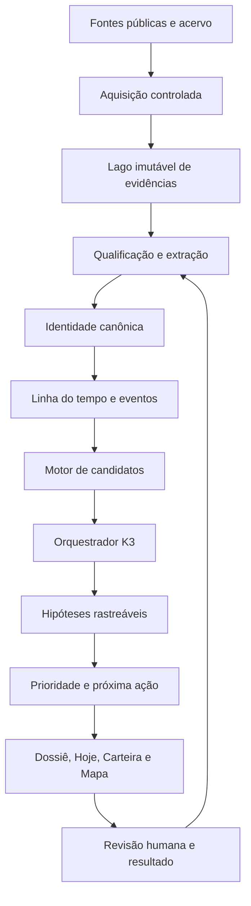

# Ultraroadmap — Sistema Operacional de Inteligência Imobiliária

> **⛔ CONGELADO em 19/07/2026 — Ondas 3 a 14 não avançam até os gates G1 e G2 do
> ROADMAP-OS.md passarem** (auditoria em AUDITORIA-PLANO-2026-07-19.md). Da Onda 0 executa-se
> apenas higiene do que já está em produção (correção de bugs do pipeline deployado, sem
> capacidade nova). Ondas 1–2 só saem do freezer se o G1 mostrar que corretores valorizam os
> sinais do radar. Motivo: a suposição mais arriscada do projeto é adoção diária, não
> tecnologia — e segue sem teste com corretor real.

**Projeto:** Corretor Inteligente / Radar Fundiário  
**Versão do plano:** 1.0  
**Data-base:** 19/07/2026  
**Escopo:** produto, dados, coleta, identidade imobiliária, Kimi K3, frontend, operação, segurança e evolução orientada por evidências.

---

## 1. Resultado final pretendido

O Corretor Inteligente deve deixar de ser apenas um mapa, uma carteira ou um assistente que responde perguntas. O produto final será um **sistema operacional de inteligência imobiliária** que:

1. mantém uma visão viva de imóveis, anúncios, unidades, pessoas, território e eventos;
2. reconhece quando fontes diferentes falam do mesmo imóvel;
3. detecta mudanças relevantes antes que o usuário precise procurar;
4. formula hipóteses rastreáveis de oportunidade, risco ou inconsistência;
5. escolhe a próxima investigação pelo ganho esperado de informação;
6. entrega cada sinal no contexto do imóvel, do comparável, do bairro ou do investidor afetado;
7. transforma sinais em próximos movimentos comerciais claros;
8. aprende com as confirmações e rejeições do corretor sem alterar fatos automaticamente;
9. acumula um histórico proprietário que se torna mais valioso a cada coleta e decisão.

O Kimi K3 será o **diretor de investigação**, não o banco de dados, o coletor universal ou a fonte da verdade.

---

## 2. Estado atual e diagnóstico

### 2.1 O que já existe

- carteira privada de imóveis, contatos, oportunidades, tarefas e eventos;
- comparáveis, avaliações, documentos e contexto territorial;
- assistente contextual por imóvel, contato, avaliação e visita;
- runtime Hermes/Kimi K3 isolado;
- fila assíncrona de inteligência;
- planejamento de consultas pelo K3;
- armazenamento de evidências e achados;
- análise em lotes retomáveis;
- vínculos iniciais entre achados e imóveis por relação direta, comparável ou bairro;
- exibição inicial no dossiê, na carteira e na tela Hoje;
- revisão humana de sinais;
- trilha de auditoria e separação entre hipótese e base canônica.

### 2.2 O que a primeira execução real revelou

A primeira varredura útil processou 108 evidências, produziu 43 candidatos e preservou 20 achados. Também revelou problemas estruturais:

- páginas-catálogo dominando os lotes;
- resultados fora de Goiânia;
- aluguel misturado com venda;
- conteúdo não imobiliário ingerido como imóvel;
- parâmetros de filtros interpretados como atributos do imóvel;
- URLs de catálogo usadas como identidade de anúncio;
- atributos de imóveis diferentes misturados na mesma página;
- cobertura excessiva de uma única fonte;
- ausência de datas públicas confiáveis em muitos resultados;
- K3 gastando tempo para descobrir problemas que deveriam ser eliminados antes da análise;
- síntese final excedendo o timeout mesmo depois do processamento em lotes.

### 2.3 Conclusão do diagnóstico

O maior gargalo não é a capacidade intelectual do K3. É a **qualidade e a identidade do material entregue ao K3**.

O próximo salto de produto exige uma camada intermediária forte:

> Internet → evidência bruta → qualificação → identidade → eventos → candidatos → investigação K3 → hipótese → decisão humana.

---

## 3. Princípios inegociáveis

### P1 — Evidência antes de conclusão

Todo sinal precisa apontar para observações datadas e fontes recuperáveis. Sem evidência, não existe achado.

### P2 — Hipótese não é fato

K3, regras heurísticas e scores geram candidatos. Somente coleta verificável ou revisão humana promove informação.

### P3 — Identidade antes de estatística

Não calcular mudança de preço, tempo de exposição, duplicidade ou liquidez antes de resolver qual anúncio e qual imóvel estão sendo observados.

### P4 — Determinístico no que é claro; K3 no que é ambíguo

URL, domínio, geografia, formato, preço, datas e regras de integridade devem ser tratados localmente. O modelo entra em relações semânticas, investigação e explicação.

### P5 — O usuário vê decisões, não infraestrutura

Nada de runtime, batch, prompt, token ou `data_conflict` na experiência principal. A interface traduz o sistema para linguagem de corretor e investidor.

### P6 — Todo sinal tem contexto

O produto distingue explicitamente:

- sobre este imóvel;
- sobre uma unidade do edifício;
- sobre um comparável;
- sobre o bairro;
- sobre o território;
- sobre a qualidade da fonte;
- sobre um investidor ou negociação.

### P7 — Próxima ação acima de relatório

Um achado só é útil se explicar por que importa e o que o usuário pode verificar ou fazer.

### P8 — Segurança e privacidade por construção

Documentos privados, dados pessoais e fatos públicos permanecem em domínios separados. Conteúdo externo é sempre não confiável.

### P9 — Orçamento orientado por valor

Pesquisa, tokens e tempo de processamento devem ser aplicados onde exista maior impacto, urgência, incerteza ou valor de informação.

### P10 — Frontend é parte do motor de confiança

Rótulos, fontes, estados, histórico, explicações e ações humanas não são acabamento. São elementos centrais da validade do produto.

---

## 4. Arquitetura-alvo

### 4.1 Camadas

| Camada | Responsabilidade | Pode escrever na base canônica? |
|---|---|---:|
| Aquisição | Buscar páginas, arquivos, APIs e snapshots | Não |
| Evidências | Preservar conteúdo, origem e momento | Não |
| Qualificação | Classificar fonte e extrair fatos observados | Somente observações |
| Identidade | Relacionar anúncio, unidade, edifício e imóvel | Apenas vínculos versionados |
| Eventos | Registrar mudanças derivadas de observações | Sim, como eventos auditáveis |
| Candidatos | Gerar sinais por regras transparentes | Não |
| K3 | Planejar, investigar, cruzar e explicar | Não |
| Hipóteses | Guardar oportunidade, risco ou conflito | Não |
| Revisão | Confirmar, rejeitar ou pedir verificação | Somente por ação humana |
| Produto | Entregar contexto e próxima ação | Não diretamente |

---

## 5. Modelo de domínio-alvo

### 5.1 Entidades principais

#### `canonical_properties`

Representa o imóvel real ou o melhor candidato a imóvel real.

- `id`;
- tipo;
- endereço canônico;
- geometria;
- edifício/condomínio;
- quadra/lote/inscrição quando disponíveis;
- nível de identidade;
- status de revisão;
- primeira e última observação;
- atributos confirmados;
- atributos ainda conflitantes.

#### `property_units`

Representa unidades quando um edifício ou condomínio possui múltiplos imóveis.

- imóvel canônico pai;
- torre/bloco;
- unidade;
- andar;
- área privativa e total;
- quartos/vagas;
- chaves de identidade;
- estado de confirmação.

#### `source_records`

Representa o objeto externo encontrado em uma fonte.

- fonte;
- identificador externo;
- URL canônica;
- tipo de registro;
- transação;
- localidade;
- nível de qualidade;
- primeiro e último encontro;
- situação observada.

#### `source_observations`

Snapshot imutável do que uma fonte mostrou em determinado momento.

- `source_record_id`;
- instante de observação;
- conteúdo e hash;
- título e descrição;
- preço pedido;
- condomínio/IPTU;
- áreas;
- quartos/vagas;
- endereço;
- anunciante;
- fotos e hashes perceptuais;
- disponibilidade;
- qualidade de extração;
- evidência de origem por campo.

#### `entity_match_candidates`

Guarda propostas de vínculo entre registros externos e imóveis/unidades.

- par de entidades;
- features comparadas;
- score determinístico;
- parecer K3 quando necessário;
- decisão;
- autor da decisão;
- versão da política;
- justificativa.

#### `property_events`

Linha do tempo derivada de observações confirmadas.

- imóvel/unidade;
- tipo de evento;
- antes/depois;
- evidências;
- confiança;
- regra que produziu;
- estado de revisão;
- instante observado e instante processado.

#### `intelligence_hypotheses`

Unifica os atuais findings em uma estrutura orientada a decisão.

- tipo;
- escopo e entidade afetada;
- título e explicação;
- evidências favoráveis;
- evidências contrárias;
- lacunas;
- confiança;
- impacto;
- urgência;
- acionabilidade;
- prioridade calculada;
- validade;
- próxima verificação;
- próxima ação sugerida;
- status;
- versão da política/modelo.

#### `hypothesis_feedback`

Registra o que aconteceu depois do sinal.

- hipótese;
- decisão do usuário;
- motivo;
- resultado comercial;
- valor qualitativo;
- falso positivo;
- correção fornecida;
- data de acompanhamento.

### 5.2 Graus de identidade

| Nível | Significado | Uso permitido |
|---|---|---|
| `unresolved` | Registro isolado | Pesquisa e triagem |
| `possible` | Similaridade útil, ainda ambígua | Hipótese apenas |
| `probable` | Múltiplos sinais fortes | Comparação com aviso |
| `confirmed_source` | Mesmo ID canônico na fonte | Histórico dentro da fonte |
| `confirmed_cross_source` | Mesmo imóvel confirmado entre fontes | Histórico consolidado |
| `human_confirmed` | Usuário confirmou | Base operacional confiável |

### 5.3 Proveniência por campo

Não basta saber de qual página veio o registro. Cada atributo importante precisa saber sua origem:

- valor observado;
- evidência;
- fonte;
- instante;
- método de extração;
- confiança;
- se foi confirmado ou apenas inferido.

### 5.4 Migração do modelo atual

A evolução deve ser aditiva e gradual:

| Estrutura atual | Destino | Estratégia |
|---|---|---|
| `listings` | `source_records` | Dual-write após canonicalização de URL/ID |
| `properties` públicas | candidatos a `canonical_properties` | Não migrar como identidade confirmada |
| `intelligence_evidence` | `source_observations` | Backfill preservando IDs e hashes |
| `intelligence_findings` | `intelligence_hypotheses` | Traduzir tipo, escopo, validade e evidências |
| `intelligence_finding_links` | escopos da hipótese | Preservar relação e revisão por imóvel |
| `audit_log` | permanece | Referenciar novas entidades e políticas |
| `inventory_properties` | permanece como carteira privada | Vincular ao imóvel canônico sem fundir domínios |
| `valuations` | permanece versionada | Consumir identidade/comparáveis novos gradualmente |

Durante a transição:

- leitura antiga e nova podem coexistir sob feature flag;
- nenhum backfill transforma correspondência provável em confirmação;
- dual-write deve ser idempotente;
- divergências entre modelos são medidas antes da troca;
- rollback desliga a leitura nova, sem apagar observações;
- a carteira privada nunca é reconstruída automaticamente a partir do acervo público.

---

## 6. Taxonomia de inteligência

### 6.1 Oportunidade comercial

- possível redução de preço;
- vendedor potencialmente flexível;
- imóvel reaparecido após retirada;
- anúncio antigo ainda ativo;
- imóvel abaixo de comparáveis válidos;
- divergência entre portais;
- baixa concorrência em recorte relevante;
- captação potencial;
- investidor compatível;
- terreno com potencial de desenvolvimento.

### 6.2 Risco

- atributos conflitantes;
- anúncio possivelmente desatualizado;
- disponibilidade não confirmada;
- risco cadastral/documental;
- risco ambiental/territorial;
- preço contaminado por catálogo;
- área incompatível;
- fonte não confiável.

### 6.3 Mudança de mercado

- crescimento ou retração de oferta;
- alteração de mediana por segmento;
- mudança na composição tipológica;
- concentração de descontos;
- lançamento ou leilão relevante;
- mudança territorial que afeta um conjunto de imóveis.

### 6.4 Qualidade interna

- registro duplicado;
- parser contaminado;
- fonte degradada;
- cobertura insuficiente;
- geografia incorreta;
- falha de identidade;
- evento impossível;
- extração misturando anúncios.

Qualidade interna deve aparecer em uma área operacional própria e só chegar ao corretor quando afetar uma decisão concreta.

### 6.5 Relacionamento e demanda

- imóvel compatível com cliente/investidor;
- interessado esfriando;
- nova oferta adequada a preferência declarada;
- objeção recorrente em segmento;
- oportunidade de retomada;
- imóvel alternativo para negociação perdida.

---

## 7. Prioridade orientada a decisão

### 7.1 Componentes

Cada hipótese recebe quatro componentes separados:

- **confiança:** qualidade e convergência das evidências;
- **impacto:** valor potencial para a decisão ou negócio;
- **urgência:** velocidade com que a oportunidade pode desaparecer;
- **acionabilidade:** existência de um próximo passo realista para o usuário.

### 7.2 Fórmula inicial

\[
Prioridade = Confiança \times Impacto \times Urgência \times Acionabilidade
\]

Nenhum componente deve ser escondido dentro de um score opaco. O frontend mostra a explicação, não a fórmula crua.

### 7.3 Regras de guarda

- fonte única limita confiança máxima;
- página-catálogo não sustenta sinal sobre imóvel individual;
- ausência em busca não comprova indisponibilidade;
- preço anunciado não é transação;
- bairro não prova identidade;
- similaridade visual não confirma unidade;
- hipótese expirada perde urgência;
- achado sem próxima verificação não entra no topo do Hoje;
- problema interno sem efeito no imóvel não compete com ação comercial.

---

## 8. Experiência de produto e arquitetura de informação

### 8.0 Jornadas essenciais

#### Jornada A — Corretor abre um imóvel pela manhã

1. A tela Hoje informa que o imóvel possui um sinal novo.
2. O toque abre o dossiê diretamente no radar.
3. O card explica que o sinal está ligado ao próprio imóvel, a um comparável ou ao bairro.
4. O corretor vê o que mudou, por que importa e as fontes.
5. Ele confirma, rejeita, pede nova investigação ou transforma em tarefa.
6. A decisão entra na linha do tempo e recalibra políticas futuras.

#### Jornada B — Corretor cadastra uma nova captação

1. O cadastro nasce com dados mínimos e pendências explícitas.
2. O sistema tenta vincular o imóvel a registros públicos qualificados.
3. Casos claros são associados; casos ambíguos aguardam revisão/K3.
4. O dossiê mostra cobertura, possíveis anúncios e comparáveis.
5. O corretor decide se quer uma investigação profunda.
6. O resultado chega ao mesmo dossiê, sem criar uma tela técnica paralela.

#### Jornada C — Investidor procura oportunidade

1. O investidor tem preferências e restrições declaradas.
2. O sistema cruza a carteira e sinais recentes.
3. O usuário recebe poucos matches explicados.
4. Cada match mostra pontos favoráveis, impeditivos, incertezas e evidências.
5. O corretor abre o imóvel, revisa o risco e prepara o contato.
6. O resultado da apresentação retroalimenta o matching.

#### Jornada D — O mercado muda sem ação do usuário

1. Uma nova observação válida altera preço, disponibilidade ou cobertura.
2. A identidade é confirmada antes de gerar evento.
3. O motor atualiza ou cria uma hipótese.
4. A prioridade decide se o sinal entra no Hoje, fica em acompanhamento ou é suprimido.
5. O frontend mostra “desde sua última visita”.
6. O corretor age sem precisar refazer a pesquisa.

#### Jornada E — A fonte ou o sistema está errado

1. O qualificador detecta catálogo, mistura ou geografia incorreta.
2. O registro não contamina comparáveis nem oportunidades.
3. O problema aparece na operação interna.
4. Só chega ao corretor se afetar a cobertura ou uma decisão do imóvel.
5. A correção reprocessa observações e compensa eventos derivados.
6. Nada é apagado silenciosamente.

### 8.1 Navegação principal

Manter a navegação simples:

1. **Início** — o que merece atenção agora;
2. **Carteira** — imóveis e seus estados;
3. **Assistente** — conversa contextual, sem escolha de modo;
4. **Mapa** — território e descoberta espacial;
5. **Clientes** — demanda, relacionamentos e investidores.

Não criar uma navegação principal chamada “IA”, “Agentes” ou “Orquestração”.

### 8.2 Início / Hoje

#### Objetivo

Transformar inteligência em decisões priorizadas.

#### Blocos

- resumo do escritório;
- sinais do radar pendentes;
- próximos movimentos;
- mudanças desde a última visita;
- negociações em risco;
- investigações em andamento;
- resultados que precisam de confirmação;
- alertas internos somente quando afetam uma decisão.

#### Card de ação ideal

- título em linguagem humana;
- imóvel/cliente afetado;
- por que apareceu;
- contexto: direto, comparável, bairro ou território;
- impacto e urgência qualitativos;
- data da observação;
- ação principal;
- ação secundária para ver evidências;
- possibilidade de adiar ou descartar.

#### Regras

- no máximo 5 a 8 prioridades principais;
- não repetir o mesmo imóvel sem necessidade;
- agrupar sinais relacionados;
- fatos novos acima de pendências administrativas comuns;
- sinais expirados saem do topo;
- cada ação abre diretamente o contexto correto.

### 8.3 Carteira

#### Novos filtros

- com sinais novos;
- oportunidade potencial;
- risco para verificar;
- mudança de preço;
- investigação em andamento;
- sem cobertura suficiente;
- com investidor compatível;
- sem movimento recente.

#### Card do imóvel

- estágio comercial;
- preço e bairro;
- quantidade de sinais;
- sinal mais relevante;
- última mudança observada;
- interessados abertos;
- pendências;
- status da investigação;
- selo de cobertura das fontes.

#### Ordenações

- prioridade do radar;
- atualização mais recente;
- maior potencial;
- maior urgência;
- menor cobertura;
- estágio comercial.

### 8.4 Dossiê do imóvel

#### Cabeçalho

- identidade do imóvel;
- estágio;
- preço pedido;
- bairro;
- última observação;
- status de cobertura;
- quantidade de sinais;
- ação “Perguntar ao assistente”.

#### Visão geral

1. Radar do imóvel;
2. mudança mais importante;
3. próximos movimentos;
4. dados essenciais;
5. pendências;
6. atualização cadastral.

#### Aba Mercado

Evoluir a atual aba Comercial ou criar subárea clara para:

- histórico de preço;
- anúncios possivelmente correspondentes;
- comparáveis confirmados e prováveis;
- posição na amostra;
- sinais de liquidez/exposição;
- cobertura por fonte;
- divergências;
- botão de investigação focada.

#### Aba Comercial

- interessados;
- compatibilidade com clientes/investidores;
- histórico de contato;
- objeções;
- próxima ação;
- mensagens prontas;
- oportunidades derivadas do radar.

#### Aba Território

- zoneamento;
- proximidades;
- obras e mudanças urbanas;
- riscos ambientais;
- posição relativa no bairro;
- sinais territoriais que afetam o imóvel;
- evidências cartográficas e data das camadas.

#### Aba Arquivos

- documentos;
- extração e status;
- pendências documentais;
- fatos documentais confirmados;
- conflitos entre documento e anúncio;
- nenhuma conclusão jurídica automática.

#### Aba Histórico

Linha do tempo unificada:

- cadastro do corretor;
- observações públicas;
- mudanças de preço;
- anúncios encontrados;
- investigação;
- revisão humana;
- contatos e visitas;
- documentos;
- mudanças territoriais.

Filtros por categoria devem impedir uma linha do tempo ilegível.

### 8.5 Detalhe de um sinal

Abrir em drawer/sheet, preservando o imóvel ao fundo.

#### Conteúdo

- título;
- situação atual;
- contexto do vínculo;
- por que importa;
- o que está comprovado;
- o que ainda é hipótese;
- evidências favoráveis;
- evidências contrárias;
- campos coincidentes/divergentes;
- fontes e datas;
- política/regra que gerou;
- validade;
- próxima verificação;
- ações humanas.

#### Ações

- confirmar;
- rejeitar;
- corrigir vínculo;
- marcar como mesma unidade/imóvel diferente;
- investigar novamente;
- perguntar ao assistente;
- transformar em tarefa;
- vincular a cliente/investidor;
- acompanhar mudança;
- arquivar.

### 8.6 Mapa

#### Camadas futuras

- imóveis da carteira com sinais;
- oportunidades por prioridade;
- variação de oferta;
- terrenos subutilizados;
- mudanças territoriais;
- risco ambiental;
- cobertura de fontes;
- demanda de investidores por região.

#### Interação

- clicar no sinal abre resumo contextual;
- clicar no imóvel abre o dossiê;
- filtros espaciais preservam a consulta;
- nenhum mapa de calor sem amostra mínima explícita;
- legenda mostra fonte, período e cobertura.

### 8.7 Clientes e investidores

- preferências declaradas separadas das inferidas;
- imóveis compatíveis com explicação;
- sinais que mudaram a compatibilidade;
- alertas de oportunidade;
- ação de contato;
- feedback do investidor;
- nenhuma mensagem enviada automaticamente.

---

## 9. Sistema de componentes frontend

### 9.1 Componentes fundamentais

- `RadarSummary`;
- `SignalCard`;
- `SignalDetailSheet`;
- `EvidenceList`;
- `EvidenceComparison`;
- `ContextRelationBadge`;
- `ConfidenceExplanation`;
- `ImpactUrgencyChips`;
- `NextBestAction`;
- `InvestigationStatus`;
- `PropertyTimeline`;
- `PriceHistoryChart`;
- `CoverageIndicator`;
- `SourceHealthBadge`;
- `EntityMatchReview`;
- `InvestorMatchCard`;
- `TerritorySignalCard`;
- `EmptyState`;
- `SkeletonState`;
- `ErrorRecovery`;
- `StaleDataWarning`.

### 9.2 Estados obrigatórios

Cada superfície deve especificar:

- carregando;
- vazia sem dados;
- vazia sem achados;
- investigação na fila;
- investigação em andamento;
- resultado parcial;
- resultado concluído;
- resultado expirado;
- falha recuperável;
- falha definitiva;
- offline;
- dado desatualizado;
- revisão concluída.

### 9.3 Mobile first

- ações principais alcançáveis com o polegar;
- cards curtos com expansão progressiva;
- fontes em sheet, não em nova navegação perdida;
- histórico virtualizado quando longo;
- mapas e dossiê não disputam o mesmo espaço;
- botões com alvo mínimo de 44 px;
- nada importante apenas em hover;
- filtros horizontais com estado claro;
- retorno preserva posição e contexto.

### 9.4 Desktop

- dossiê com coluna de contexto e conteúdo principal;
- sinal selecionado ao lado da linha do tempo ou mercado;
- mapa e lista sincronizados;
- atalhos de teclado onde agregarem valor;
- comparação de fontes lado a lado;
- densidade maior sem virar painel técnico.

### 9.5 Acessibilidade

- semântica de tabs, dialogs, drawers e live regions;
- foco devolvido ao elemento de origem;
- status não dependente apenas de cor;
- contraste AA;
- suporte a redução de movimento;
- fontes e evidências navegáveis por teclado;
- textos de confiança compreensíveis por leitor de tela;
- gráfico sempre acompanhado de resumo textual.

### 9.6 Performance frontend

- dossiê essencial em uma chamada;
- detalhes de evidência carregados sob demanda;
- paginação de histórico;
- imagens externas sem bloquear conteúdo;
- cache por imóvel e invalidação por versão;
- bundle sem dependências visuais desnecessárias;
- orçamento inicial de JavaScript;
- instrumentação de tempo até conteúdo útil;
- evitar polling agressivo: preferir SSE no estágio adequado.

---

## 10. Contratos de API-alvo

### 10.1 Resumo do radar do imóvel

`GET /painel/api/os/imoveis/:id/inteligencia`

Retorna:

- resumo;
- sinais agrupados;
- maior prioridade;
- cobertura;
- última coleta;
- investigação ativa;
- versão dos dados.

### 10.2 Detalhe de hipótese

`GET /painel/api/os/imoveis/:id/inteligencia/:hypothesisId`

Retorna evidências, contradições, vínculo, histórico, explicação da prioridade e ações permitidas.

### 10.3 Investigação

`POST /painel/api/os/imoveis/:id/inteligencia/investigar`

Aceita objetivo opcional, mas nunca parâmetros técnicos de runtime/modelo.

### 10.4 Revisão

`POST /painel/api/os/imoveis/:id/inteligencia/:hypothesisId/revisar`

Decisões:

- confirmar;
- rejeitar;
- inconclusivo;
- corrigir vínculo;
- acompanhar;
- transformar em tarefa.

### 10.5 Eventos de progresso

`GET /painel/api/os/inteligencia/eventos`

SSE futuro para:

- investigação iniciada;
- nova evidência qualificada;
- lote concluído;
- hipótese criada;
- investigação concluída;
- falha recuperável.

O frontend recebe mensagens de produto, não logs técnicos.

---

## 11. Estratégia do Kimi K3

### 11.1 Agentes lógicos, não modelos diferentes

O mesmo K3 pode operar com papéis isolados:

- planejador;
- pesquisador;
- resolvedor de identidade;
- verificador;
- sintetizador;
- explicador.

Cada papel recebe contexto mínimo e contrato JSON próprio. Não existe seletor de “conversa simples/normal”.

### 11.2 Política de acionamento

Acionar K3 quando:

- houver ambiguidade de identidade;
- fontes divergirem;
- uma hipótese tiver impacto potencial relevante;
- uma fonte nova precisar ser compreendida;
- regras não conseguirem explicar o caso;
- o usuário pedir investigação profunda;
- for necessário escolher a próxima melhor pesquisa.

Não acionar quando:

- uma regra local resolve;
- o conteúdo é catálogo conhecido;
- a geografia está errada;
- o hash já foi analisado;
- a pergunta é uma contagem disponível no banco;
- o resultado não pode alterar nenhuma decisão.

### 11.3 Ganho de informação

O planejador recebe:

- hipótese atual;
- evidências existentes;
- lacunas;
- custo aproximado das ferramentas;
- fontes já tentadas;
- confiabilidade das fontes;
- prazo/urgência.

Ele escolhe a pesquisa que mais reduz a incerteza sem repetir trabalho.

### 11.4 Memória e cache

- hash de conteúdo analisado;
- cache de extração;
- cache de classificação de URL;
- cache de fonte/domínio;
- reaproveitamento de plano quando objetivo não mudou;
- sessões isoladas por etapa e investigação;
- nenhum crescimento indefinido de conversa Hermes;
- compactação de resultados estruturados antes da síntese.

### 11.5 Síntese hierárquica

Substituir uma síntese única longa por:

1. resultados por cluster de entidade;
2. consolidação por hipótese;
3. ranking determinístico;
4. explicação K3 apenas dos principais sinais.

Se a explicação falhar, a hipótese estruturada permanece utilizável.

---

## 12. Ondas de implementação

As ondas abaixo são sequenciais no caminho crítico, mas itens de frontend, testes e observabilidade caminham dentro de cada onda. A duração é uma referência de planejamento, não promessa.

### Macro-horizontes sugeridos

| Horizonte | Foco | Ondas principais | Resultado demonstrável |
|---|---|---|---|
| 0–30 dias | Confiança da entrada | 0, 1 e início da 2 | Radar visível sem contaminações conhecidas |
| 31–90 dias | Memória e identidade | 2, 3, 4 e início da 5 | Histórico real e correspondência entre anúncios |
| 91–180 dias | Inteligência acionável | 5, 6, 7, 8 e 9 | Eventos, hipóteses e prioridade comercial |
| 181–270 dias | Diferenciação | 10, 11 e 12 | Investidores, território e calibração |
| Após validação | Proatividade e escala | 13 e 14 | Notificações controladas e operação ampliada |

Os horizontes assumem trabalho contínuo e decisões rápidas de produto. Capacidade disponível, mudanças de fonte e qualidade dos dados podem alterar a duração. Nenhuma onda deve avançar apenas para cumprir calendário se o gate de confiança anterior não tiver sido atingido.

## Onda 0 — Estabilizar o radar atual

**Horizonte sugerido:** 1 ciclo  
**Objetivo:** impedir que problemas já conhecidos contaminem novas execuções.

### Backend e dados

- corrigir consultas com baixa precisão geográfica;
- exigir Goiânia/GO em validação pós-busca;
- separar venda, aluguel e lançamento;
- bloquear categorias não imobiliárias;
- limitar páginas-catálogo;
- preservar achados atuais como diagnóstico;
- versionar prompts e políticas;
- registrar duração por etapa/lote;
- reduzir candidatos enviados à síntese;
- criar estado `partial_completed` ou equivalente operacional;
- revisar tratamento de duplicidade de findings entre jobs.

### Frontend

- finalizar radar no dossiê;
- exibir fila, andamento, parcial e conclusão;
- exibir última atualização;
- separar problema de fonte de oportunidade imobiliária;
- adicionar estado de atualização do app;
- validar mobile e desktop reais.

### Gate de saída

- nenhuma cidade errada aceita como Goiânia;
- nenhum veículo aceito como imóvel;
- catálogo não sustenta mudança de preço individual;
- falha de síntese não apaga resultados;
- usuário consegue localizar, abrir e revisar um sinal no imóvel.

## Onda 1 — Registro e saúde das fontes

**Horizonte sugerido:** 1 a 2 ciclos  
**Objetivo:** conhecer o comportamento de cada fonte antes de confiar nela.

### Entregas

- tabela `source_registry`;
- domínio, tipo, método permitido, frequência e limites;
- política de URL individual vs catálogo;
- canonicalização de URLs;
- indicadores de saúde;
- taxa de sucesso;
- taxa de catálogo;
- taxa de geografia errada;
- campos normalmente disponíveis;
- última coleta válida;
- circuit breaker por fonte degradada;
- fila de revisão de fontes novas.

### Frontend operacional

- área administrativa de saúde das fontes;
- sem exposição na navegação principal;
- alertas somente quando a cobertura do imóvel for afetada;
- selo “cobertura limitada” no dossiê.

### Gate de saída

- cada evidência identifica fonte e tipo;
- fonte degradada não domina um lote;
- cobertura e qualidade podem ser explicadas ao usuário.

## Onda 2 — Qualificação determinística de evidências

**Horizonte sugerido:** 2 ciclos  
**Objetivo:** entregar ao K3 apenas material potencialmente útil.

### Pipeline

- classificação por URL e conteúdo;
- cidade/UF;
- venda/locação;
- anúncio/catálogo/notícia/leilão/oficial;
- imóvel/não imóvel;
- data observada vs data publicada;
- extração de identificador externo;
- detecção de filtro de URL;
- detecção de mistura de múltiplos anúncios;
- score de completude;
- score de qualificabilidade;
- motivo de rejeição;
- testes de fixtures por fonte.

### Frontend

- cobertura por fonte no imóvel;
- explicação “por que ainda não há sinal”;
- nenhuma mensagem genérica de “IA não encontrou”.

### Gate de saída

- precisão mínima acordada para anúncio individual;
- páginas rejeitadas continuam auditáveis;
- redução mensurável de tokens por evidência útil;
- nenhum campo importante sem proveniência.

## Onda 3 — Observações imutáveis e histórico real

**Horizonte sugerido:** 2 ciclos  
**Objetivo:** trocar registros sobrescritos por snapshots temporais.

### Entregas

- `source_records`;
- `source_observations`;
- hash de conteúdo;
- diff de campos;
- primeira/última observação;
- estado visto/não visto sem concluir indisponibilidade;
- política de retenção;
- reprocessamento por versão de extrator;
- migração controlada do acervo atual.

### Frontend

- linha do tempo de observações;
- preço com fonte e data;
- indicação de “não visto desde” em vez de “removido”; 
- comparação antes/depois.

### Gate de saída

- todo evento de mudança reconstrói suas observações;
- nenhuma mudança baseada apenas na URL de catálogo;
- histórico não é perdido ao corrigir parser.

## Onda 4 — Identidade canônica de anúncio e imóvel

**Horizonte sugerido:** 3 a 4 ciclos  
**Objetivo:** reconhecer o mesmo imóvel e separar unidades diferentes.

### Features determinísticas

- ID externo;
- URL canônica;
- endereço normalizado;
- edifício/condomínio;
- coordenadas;
- quadra/lote/inscrição;
- área e tolerância;
- quartos/vagas;
- anunciante;
- preço e proximidade temporal;
- texto raro;
- hashes perceptuais de fotos.

### Motor de decisão

- pares candidatos baratos;
- score explicável;
- regras de exclusão;
- níveis de identidade;
- fila K3 para ambíguos;
- revisão humana;
- políticas versionadas;
- desfazer/mesclar/separar sem apagar histórico.

### Frontend

- comparação lado a lado;
- destacar coincidências e divergências;
- ações “mesmo imóvel”, “unidade diferente”, “não relacionado”;
- mostrar efeito da decisão antes de confirmar;
- desfazer revisão.

### Gate de saída

- conjunto de verdade manual para avaliação;
- alta precisão nos vínculos automáticos;
- nenhum merge automático em caso de unidade ambígua;
- histórico consolidado somente após identidade suficiente.

## Onda 5 — Linha do tempo e motor de eventos

**Horizonte sugerido:** 2 ciclos  
**Objetivo:** converter observações em mudanças confiáveis.

### Eventos

- anúncio apareceu;
- preço observado mudou;
- descrição/área mudou;
- fonte adicional encontrada;
- não visto desde determinada data;
- reapareceu;
- anunciante mudou;
- conflito criado/resolvido;
- cobertura aumentou/diminuiu;
- comparável entrou/saiu da política;
- mudança territorial.

### Regras

- idempotência;
- event time vs processing time;
- correção retroativa;
- versão da política;
- compensação em caso de identidade desfeita;
- auditoria.

### Frontend

- histórico agrupado por dia e categoria;
- resumo “desde sua última visita”;
- filtros;
- eventos corrigidos visíveis, sem sumir silenciosamente.

### Gate de saída

- eventos repetidos não duplicam;
- correção de identidade recompõe a linha do tempo;
- usuário entende o que mudou sem abrir logs.

## Onda 6 — Motor tipado de hipóteses

**Horizonte sugerido:** 2 a 3 ciclos  
**Objetivo:** substituir findings genéricos por objetos orientados à decisão.

### Entregas

- taxonomia versionada;
- schema por tipo;
- evidências favoráveis e contrárias;
- validade;
- lacunas;
- escopo;
- impacto/urgência/acionabilidade;
- próxima verificação;
- próxima ação;
- deduplicação e agrupamento;
- atualização de hipótese existente em vez de spam;
- expiração e reabertura.

### Frontend

- cards específicos por tipo;
- linguagem adequada a oportunidade, risco, mudança ou qualidade;
- detalhe completo;
- revisão por vínculo;
- estados confirmado/rejeitado/inconclusivo/acompanhando.

### Gate de saída

- nenhum enum técnico cru na UI;
- toda hipótese tem contexto, validade e próxima verificação;
- sinais iguais não se repetem em vários lugares.

## Onda 7 — Orquestração K3 por ganho de informação

**Horizonte sugerido:** 3 ciclos  
**Objetivo:** pesquisar menos e descobrir mais.

### Entregas

- planejador com ferramentas e custos;
- registro de tentativas e fontes já usadas;
- stop conditions reais;
- escolha de consulta por lacuna;
- orçamento por investigação;
- limite por fonte;
- cache semântico/estrutural;
- papéis isolados;
- síntese por cluster;
- fallback estruturado;
- avaliação de plano;
- prevenção de prompt injection;
- kill switch por custo/falha.

### Frontend

- objetivo compreensível;
- progresso por etapas de produto;
- cancelamento;
- investigação parcial;
- indicação de próxima tentativa;
- nenhuma promessa de conclusão instantânea.

### Gate de saída

- menos chamadas por achado útil;
- redução de tempo médio;
- retomada sem refazer etapas;
- nenhum job perde progresso;
- plano para quando valor marginal da próxima busca for baixo.

## Onda 8 — Hoje e priorização comercial

**Horizonte sugerido:** 2 ciclos  
**Objetivo:** transformar hipóteses em agenda útil.

### Entregas

- score decomponível;
- agrupamento por imóvel;
- supressão de baixa relevância;
- regras de urgência;
- limite diário;
- adiar;
- acompanhar;
- transformar em tarefa;
- medir ação tomada;
- digest desde última visita.

### Frontend

- top prioridades;
- seção secundária “acompanhar”;
- motivo da posição;
- ações rápidas;
- personalização progressiva sem tela de configurações complexa.

### Gate de saída

- usuário consegue decidir o dia em menos de 2 minutos;
- nenhum imóvel domina a tela por duplicidade;
- sinais internos não afogam oportunidades comerciais.

## Onda 9 — Comparáveis, liquidez e exposição

**Horizonte sugerido:** 3 ciclos  
**Objetivo:** melhorar análise de mercado sem prometer preço de transação.

### Entregas

- comparáveis por identidade e política;
- tempo observado de exposição;
- frequência de reprecificação;
- cobertura por portal;
- faixa e dispersão;
- qualidade da amostra;
- diferença entre unidade, edifício e bairro;
- sinais de anúncio parado/reaparecido;
- nenhuma conclusão de venda sem prova.

### Frontend

- gráfico de preço observado;
- timeline de exposição;
- tabela de comparáveis com motivos;
- exclusão/revisão manual;
- visual de cobertura e dispersão;
- disclaimers integrados, não escondidos.

### Gate de saída

- toda métrica informa amostra, período e fonte;
- catálogo não entra como comparável individual;
- decisão manual recalcula sem sobrescrever versão anterior.

## Onda 10 — Matching de clientes e investidores

**Horizonte sugerido:** 2 a 3 ciclos  
**Objetivo:** conectar oferta inteligente à demanda real.

### Entregas

- preferências declaradas, observadas e inferidas separadas;
- restrições duras vs preferências;
- matching explicável;
- atualização por sinais;
- feedback após apresentação;
- aprendizado de objeções;
- alerta de nova compatibilidade;
- privacidade e consentimento.

### Frontend

- “quem pode se interessar” no imóvel;
- “novos imóveis compatíveis” no cliente;
- motivos favoráveis e impeditivos;
- mensagem pronta;
- registro de apresentação;
- resultado do contato.

### Gate de saída

- nenhum match contradiz restrição declarada;
- usuário entende por que houve match;
- contato continua sempre humano.

## Onda 11 — Inteligência territorial e desenvolvimento

**Horizonte sugerido:** 3 a 4 ciclos  
**Objetivo:** unir imóvel e transformação urbana.

### Entregas

- zoneamento versionado;
- Plano Diretor atual e histórico;
- eixos, corredores, OOAU, ADD, AEIS;
- obras e infraestrutura;
- riscos ambientais;
- terrenos subutilizados;
- potencial construtivo com fonte legal;
- mudanças espaciais como eventos;
- impacto em imóveis e carteiras.

### Frontend

- mapa temporal;
- badges territoriais;
- “o que mudou nesta área”;
- fontes legais e data;
- comparação antes/depois;
- nunca emitir parecer urbanístico automático.

### Gate de saída

- toda regra territorial cita camada e data;
- unidade espacial correta;
- ausência de camada não vira conclusão;
- sinais chegam aos imóveis afetados.

## Onda 12 — Feedback, calibração e avaliação contínua

**Horizonte sugerido:** contínuo, início em 2 ciclos  
**Objetivo:** fazer o sistema melhorar com uso real.

> Plano de execução auditado: `ROADMAP-AUTOEVOLUCAO-CORRETOR-AUTONOMO.md`.

### Entregas

- motivos estruturados de revisão;
- conjunto ouro de identidade;
- conjunto ouro de hipóteses;
- precisão por tipo;
- precisão por fonte;
- taxa de ação;
- resultado comercial;
- tempo até confirmação;
- detecção de regressão;
- comparação de políticas/prompts;
- rollout controlado.

### Frontend

- feedback em um toque;
- correção detalhada opcional;
- histórico de decisões;
- desfazer;
- nenhuma pergunta de feedback interrompendo tarefas urgentes.

### Gate de saída

- toda mudança de política roda contra conjuntos de avaliação;
- regressão impede deploy;
- confiança exibida é calibrada por tipo, não um número decorativo.

## Onda 13 — Operação proativa e notificações

**Horizonte sugerido:** 2 ciclos  
**Objetivo:** avisar no momento certo sem virar spam.

### Entregas

- eventos em tempo quase real quando a fonte permitir;
- digest diário;
- preferências de canal;
- quiet hours;
- deduplicação;
- reenvio controlado;
- alertas críticos;
- automações sempre autorizadas.

### Frontend

- central de notificações;
- preferências simples;
- histórico;
- marcar como visto;
- abrir no contexto;
- controle de frequência.

### Gate de saída

- nenhum envio externo sem autorização explícita;
- alerta duplicado não é reenviado;
- cada notificação explica por que chegou.

## Onda 14 — Escala, portabilidade e produto multioperação

**Horizonte sugerido:** após validação do núcleo  
**Objetivo:** crescer sem degradar confiança.

### Entregas

- filas por organização;
- isolamento de custo;
- limites e quotas;
- particionamento de observações;
- retenção e arquivamento;
- fontes por cidade;
- políticas geográficas;
- RBAC completo;
- exportação e portabilidade;
- recuperação de desastre;
- operação multiusuário/equipe.

### Gate de saída

- isolamento entre organizações comprovado;
- custos atribuíveis;
- restauração testada;
- experiência individual não piora com escala.

---

## 13. Trilha transversal de segurança e governança

### Segurança

- SSRF bloqueado por allowlist/proxy de aquisição;
- URLs externas nunca acessadas pelo navegador com credenciais;
- sanitização de conteúdo;
- proteção contra prompt injection;
- limites de tamanho;
- timeouts;
- circuit breakers;
- segredos fora do banco e do frontend;
- sessão e CSRF;
- CSP;
- downloads privados;
- logs sem PII;
- dependências atualizadas e auditadas.

### LGPD e privacidade

- minimização;
- separação entre dado público e privado;
- telefone mascarado quando não necessário;
- documentos nunca enviados integralmente ao K3 por padrão;
- consentimento e finalidade;
- retenção;
- exclusão e portabilidade;
- trilha de acesso;
- nenhum enriquecimento pessoal invasivo.

### Governança de IA

- versão de modelo, prompt e política;
- evidências de entrada;
- saída estruturada validada;
- motivo de fallback;
- custo e duração;
- revisão humana;
- nenhuma escrita canônica autônoma;
- kill switch;
- avaliação antes de rollout.

---

## 14. Observabilidade e métricas

### 14.1 Produto

- tempo até primeiro sinal útil;
- sinais revisados por semana;
- percentual confirmado/rejeitado/inconclusivo;
- ações iniciadas a partir de sinais;
- oportunidades comerciais originadas;
- imóveis com cobertura suficiente;
- tempo do usuário até decidir a próxima ação;
- retorno ao dossiê após alerta.

### 14.2 Dados

- anúncio individual vs catálogo;
- geografia correta;
- campos com proveniência;
- duplicidade;
- identidade confirmada;
- eventos corrigidos;
- cobertura por fonte/bairro/tipo;
- idade das observações.

### 14.3 Inteligência

- precisão por hipótese;
- recall em conjunto avaliado;
- calibração de confiança;
- candidatos por achado útil;
- chamadas K3 por achado útil;
- tokens por hipótese confirmada;
- taxa de síntese/fallback;
- pesquisas repetidas evitadas;
- ganho de informação por consulta.

### 14.4 Operação

- jobs pendentes/em execução/falhos;
- duração por etapa;
- fonte degradada;
- taxa HTTP;
- uso de banco;
- tamanho do lago;
- tempo de API;
- erros frontend;
- Core Web Vitals;
- custo por organização e fonte.

### 14.5 Metas iniciais de qualidade e SLOs

São metas de engenharia a calibrar com dados reais, não promessas comerciais:

| Indicador | Meta inicial |
|---|---:|
| Vazamento geográfico após qualificação | menor que 1% |
| Conteúdo não imobiliário aceito | menor que 0,5% |
| Catálogo aceito como anúncio individual | menor que 2% |
| Campos críticos com proveniência | 100% |
| Perda de progresso em job retomável | 0% |
| Precisão de merges automáticos no conjunto ouro | maior que 98% |
| Sinais sem evidência válida | 0% |
| Dossiê essencial — API p95 | menor que 500 ms |
| Abertura do dossiê em rede móvel — conteúdo útil | menor que 2,5 s |
| Ações principais acessíveis por teclado | 100% |
| Jobs com estado final ou nova tentativa explicada | 100% |
| Hipóteses com próxima verificação | 100% |

O alvo de confirmação de hipóteses deve ser definido por tipo. Uma taxa única incentivaria a supressão de sinais exploratórios valiosos ou a exibição excessiva de casos óbvios.

---

## 15. Estratégia de testes

### Dados e extração

- fixtures reais versionadas por fonte;
- URLs catálogo/individual;
- cidades homônimas;
- venda/aluguel;
- páginas com múltiplos anúncios;
- preços de filtros;
- páginas sem data;
- conteúdo malicioso;
- mudanças de layout.

### Identidade

- pares positivos confirmados;
- unidades diferentes do mesmo prédio;
- anúncios semelhantes mas distintos;
- endereço parcial;
- área divergente;
- fotos repetidas;
- merge/split/desfazer;
- regressão por política.

### Hipóteses

- evidência ausente;
- evidência contraditória;
- fonte única;
- validade;
- deduplicação;
- expiração;
- prioridade;
- revisão por vínculo.

### K3

- JSON inválido;
- referência a evidência inexistente;
- prompt injection na fonte;
- timeout por etapa;
- retomada;
- cache;
- orçamento;
- plano redundante;
- síntese parcial;
- fallback sem perda.

### Frontend

- contratos de API;
- componentes e estados;
- mobile/desktop;
- teclado e leitor de tela;
- conexão lenta;
- offline;
- investigação longa;
- retorno ao contexto;
- fontes externas;
- revisão e desfazer;
- screenshots de regressão visual;
- fluxo ponta a ponta do sinal à ação.

### Segurança

- autorização por organização;
- CSRF;
- XSS em título/resumo/fonte;
- URL maliciosa;
- arquivo privado;
- PII em log;
- injeção SQL;
- SSRF;
- payload excessivo;
- isolamento de runtime.

---

## 16. Estratégia de rollout

### Feature flags

- qualificador novo;
- identidade automática;
- hipótese por tipo;
- ranking novo;
- K3 planner novo;
- SSE;
- matching de investidores;
- territorial.

### Shadow mode

Novas políticas rodam sem afetar a UI. Comparar resultado com a política atual e revisão manual.

### Canary

Liberar para parte dos imóveis ou um tipo de hipótese antes de toda a carteira.

### Backfill

- idempotente;
- com versão;
- pausável;
- métricas;
- sem bloquear tráfego;
- resultados revisáveis;
- rollback lógico, não destrutivo.

### Rollback

- código anterior preservado;
- migrations aditivas;
- flags desligáveis;
- nenhuma exclusão de observação;
- política anterior ainda executável durante a transição.

---

## 17. Sequência crítica recomendada

| Ordem | Entrega | Motivo |
|---:|---|---|
| 1 | Estabilizar e qualificar fontes | Evita gastar K3 com lixo |
| 2 | Observações imutáveis | Cria histórico verdadeiro |
| 3 | Identidade canônica | Destrava mudança, duplicidade e exposição |
| 4 | Eventos | Transforma snapshots em movimento |
| 5 | Hipóteses tipadas | Organiza inteligência para decisão |
| 6 | K3 por ganho de informação | Otimiza profundidade, tempo e custo |
| 7 | Hoje e dossiê completos | Converte motor em valor diário |
| 8 | Comparáveis e liquidez | Aprofunda análise econômica |
| 9 | Clientes/investidores | Conecta oferta à demanda |
| 10 | Território | Cria diferenciação proprietária |
| 11 | Feedback e calibração | Melhora precisão com uso real |
| 12 | Proatividade e escala | Cresce depois de validar valor |

---

## 18. Backlog inicial priorizado

### P0 — Bloqueadores de confiança

- `DQ-01`: classificador catálogo vs anúncio;
- `DQ-02`: guarda Goiânia/GO;
- `DQ-03`: venda vs aluguel;
- `DQ-04`: bloqueio não imobiliário;
- `DQ-05`: preço de filtro não é preço pedido;
- `DQ-06`: detecção de múltiplos anúncios;
- `ID-01`: URL canônica e ID externo;
- `EV-01`: snapshot imutável;
- `FE-01`: estados completos da investigação;
- `FE-02`: detalhe do sinal com evidências;
- `OBS-01`: funil de métricas por etapa.

### P1 — Núcleo de inteligência

- `ID-02`: pares candidatos;
- `ID-03`: score explicável;
- `ID-04`: revisão de identidade;
- `EV-02`: eventos temporais;
- `HY-01`: schema tipado;
- `HY-02`: prioridade decomposta;
- `OR-01`: planejador por lacuna;
- `OR-02`: cache de análise;
- `FE-03`: timeline;
- `FE-04`: mercado/comparáveis;
- `FE-05`: Hoje priorizado.

### P2 — Diferenciação comercial

- `CRM-01`: matching de investidores;
- `CRM-02`: feedback de apresentação;
- `TR-01`: eventos territoriais;
- `TR-02`: terrenos subutilizados;
- `TR-03`: mudanças urbanísticas;
- `NT-01`: digest e notificações;
- `CAL-01`: calibração por tipo/fonte.

---

## 19. Definição de pronto global

Uma funcionalidade de inteligência só está pronta quando:

- possui schema e contrato versionado;
- identifica evidências e proveniência;
- distingue hipótese de fato;
- tem estado vazio, carregando, parcial, erro e concluído;
- funciona em mobile e desktop;
- é acessível por teclado;
- possui ação humana clara;
- registra auditoria;
- respeita organização e privacidade;
- tem testes unitários, integração e fluxo principal;
- tem métricas;
- possui rollback ou flag;
- apresenta linguagem de usuário, não de infraestrutura;
- não aumenta custo/latência sem orçamento explícito;
- passa pelo conjunto de avaliação relevante.

---

## 20. Marcos de produto

### Marco A — Radar confiável

O sistema coleta somente evidências qualificadas, mostra sinais no imóvel e explica suas fontes.

### Marco B — Mercado com memória

O sistema reconhece anúncios, mantém histórico e detecta mudanças reais.

### Marco C — Inteligência acionável

Hipóteses tipadas e priorizadas organizam a tela Hoje e geram próximos movimentos.

### Marco D — Inteligência comercial

Imóveis, clientes e investidores são conectados com explicações e feedback.

### Marco E — Inteligência territorial proprietária

Mercado, cadastro urbano e transformação territorial passam a formar um grafo único.

### Marco F — Sistema autoaperfeiçoável controlado

O produto mede resultados, calibra políticas e melhora sem promover mudanças sem revisão.

---

## 21. Decisão imediata

A próxima implementação não deve adicionar mais consultas amplas ao K3. Deve iniciar a **Onda 0 e a Onda 1**, com prioridade absoluta para:

1. qualificar a fonte antes da análise;
2. impedir catálogo, geografia errada e conteúdo não imobiliário;
3. criar observações imutáveis;
4. definir identidade de anúncio;
5. finalizar a experiência de sinais no dossiê com estados completos;
6. medir quantas evidências qualificadas realmente produzem decisões úteis.

Esse caminho transforma o K3 de leitor caro de material ruidoso em investigador focado sobre uma base imobiliária que melhora continuamente.
